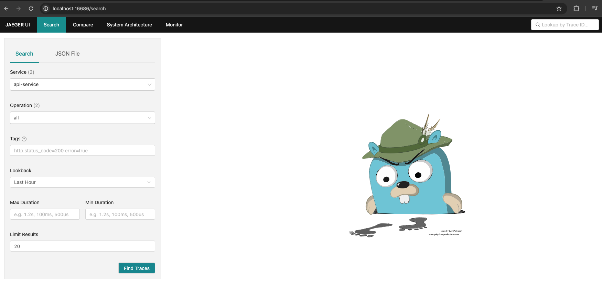
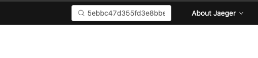
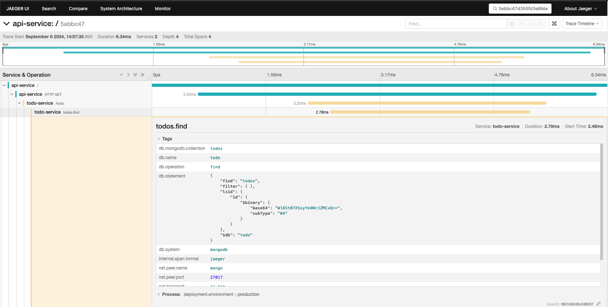

<h1 align="center">OTEL to-do app</h1>

## 📜 Summary
- [About](#About)
- [Libs/Dependencies](#Libs/Dependencies)
- [Run](#Run)
- [Endpoints](#Endpoints)
- [Tracing](#Tracing)


<a id="About"></a> 
## 📃 About
This app is just an experiment of open telemetry tracing using Go with 2 web servers. Basically, one server makes a request to another and we can track the steps of each request. This code is based on <a href=" https://www.aspecto.io/blog/opentelemetry-go-getting-started/">aspecto </a>getting started tracing tutorial. After running the project, check it out the <a href="#Endpoints">endpoints</a> section. To run this project you need to have docker installed on your machine. 

---
<a id="Libs/Dependencies"></a> 
## 🗄 Libs/Dependencies </br>

| Name        | Description | Documentation | Installation |
| ----------- | ----------- | ------------- | ----------- |     
| gin      | web http router       |  https://github.com/gin-gonic/gin |  go get github.com/gin-gonic/gin      |
| mongodb driver          | database mongo driver                      |  https://go.mongodb.org/mongo-driver/mongo                         |  go get go.mongodb.org/mongo-driver/mongo                                      | 
|otelgin                 | open telemetry gin instrumentation                          | https://go.opentelemetry.io/contrib/instrumentation/github.com/gin-gonic/gin/otelgin | go get go.opentelemetry.io/contrib/instrumentation/github.com/gin-gonic/gin/otelgin                        | 
| otelhttp                    | open telemetry http instrumentation                       | https://go.opentelemetry.io/contrib/instrumentation/net/http/otelhttp   | go get go.opentelemetry.io/contrib/instrumentation/net/http/otelhttp                           | 
| otelmongo                | open telemetry mongodb instrumentation                | https://go.opentelemetry.io/contrib/instrumentation/go.mongodb.org/mongo-driver/mongo/otelmongo  | go get go.opentelemetry.io/contrib/instrumentation/go.mongodb.org/mongo-driver/mongo/otelmongo              | 
| otel API          | open telemetry API lib           | https://pkg.go.dev/go.opentelemetry.io/otel                    | go get go.opentelemetry.io/otel
| otel Trace              | otel tracing package               | https://pkg.go.dev/go.opentelemetry.io/otel/trace                   | go get go.opentelemetry.io/otel/trace
|otel propagation               | lib that contains the context propagation                | https://pkg.go.dev/go.opentelemetry.io/otel/propagation                   | go get go.opentelemetry.io/otel/propagation
| otel Jaeger              | Jaeger SDK to Go                 | https://go.opentelemetry.io/otel/exporters/jaeger                   | go get go.opentelemetry.io/otel/exporters/jaeger
| otel resource              | api that providers resources                | https://pkg.go.dev/go.opentelemetry.io/otel/sdk/resource | go get go.opentelemetry.io/otel/sdk/resource
| otel semconv              | lib that implements otel conventions                 | https://pkg.go.dev/go.opentelemetry.io/otel/semconv/v1.17.0                   | go get go.opentelemetry.io/otel/semconv/v1.17.0

---
<a id="Run"></a> 
## ⚙️ Run

There's two ways of starting this project: using docker to start the webservers and the database on containers or start the database via docker and starting the server locally on your machine.

### Using docker for database and webserver

Run one of the commands below to build golang image:

```bash
docker-compose -f docker-compose.production.yml build
```

```bash
make build
```

Then run one of the commands below to start the containers:

```bash
docker-compose -f docker-compose.production.yml up -d
```

```bash
make run_prod
```

If you want to destroy it all, run one of the commands below:

```bash
docker-compose -f docker-compose.production.yml down
```

```bash
make down
```

### Using docker for database and webserver locally

Run one of the commands below to start the database:

```bash
docker compose up -d
```

```bash
make infra_up
```

then start the api:

```bash
go run main.go
```

```bash
make run
```

If you want to destroy the database's docker, run one of the commands below:

```bash
docker compose down 
```

```bash
make infra_down
```

<a id="Endpoints"></a> 
## 💻 Endpoints

<h4>List to-do activities</h4>

Request: 

```bash
curl --location 'http://localhost:8888'
```

Response: 

statusCode: 200<br>
```bash
{
    "error": "",
    "trace_id": "5ebbc47d355fd3e8bbe31b71b0ecd75a",
    "data": [
        {
            "ID": "66db420b8543dd4975b88d9c",
            "Title": "Buy groceries"
        },
        {
            "ID": "66db420b8543dd4975b88d9d",
            "Title": "Study"
        },
        {
            "ID": "66db420b8543dd4975b88d9e",
            "Title": "Walk with the dog"
        }
    ]
}
```

<a id="Tracing"></a> 
## 🔬 Tracing

This api is monitored with tracing. The exporter that is being used is the "Jaeger". Docker is used to run it.
All the endpoints has the traceID inside the body of the request response, so you just need access it and search the trace
using the traceID. Explanation about how to do it below:</br></br>

1. With your browser, go to jaeger homepage on http://localhost:16686/search </br></br>
    

2. Search in the search bar using the traceID. The search bar is up the right corner in the screen. The traceID can be found at the 
response of any request. See the <a href="#Endpoints">endpoints</a> section for more information.</br></br>
    

3. Check out all the spans that the endpoint produced. </br></br>
    